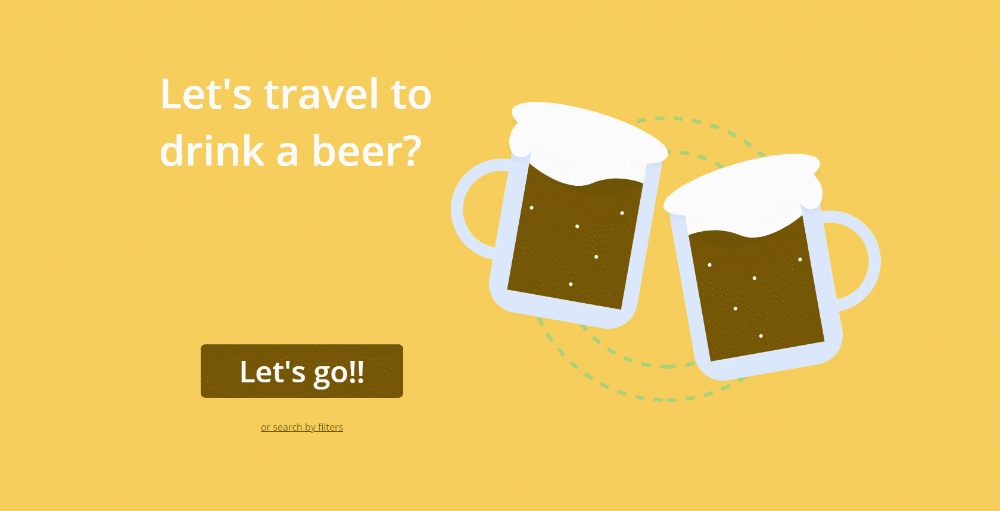

<h1 align="center">
    Driking Around The World
<h1>

<h1 align="center">ReactJS || Typescript
    
  
        
        
    

</h1>

## ❓ About

### **Driking Around The World** is an application to search a best place to find a good beer. We can do a good choice for you or you can find a beer throught the location.

## 🚧 Implementation

#### To create this application I use React to make a SPA and use librarys with more facility. 

    
## 💻 Tecnologies 
-  [Typescript](https://www.typescriptlang.org/)
-  [ReactJS](https://reactjs.org/)
-  [Axios](https://github.com/axios/axios)
-  [Leaflet](https://react-leaflet.js.org/)

## 🔥 Let's run!

- ### **You must have...**

  -  **[Node.js](https://nodejs.org/en/)**
  -  **[Git](https://git-scm.com/)**
  -  **[NPM](https://www.npmjs.com/)** or **[Yarn](https://yarnpkg.com/)**.

### To init backend server you have to navigate to api and run:
    
    $ npm install

### after

    $ npm start

#### To run frontend server you have to navigate to ui and run:

    $ npm install

#### after:

    $ npm start
